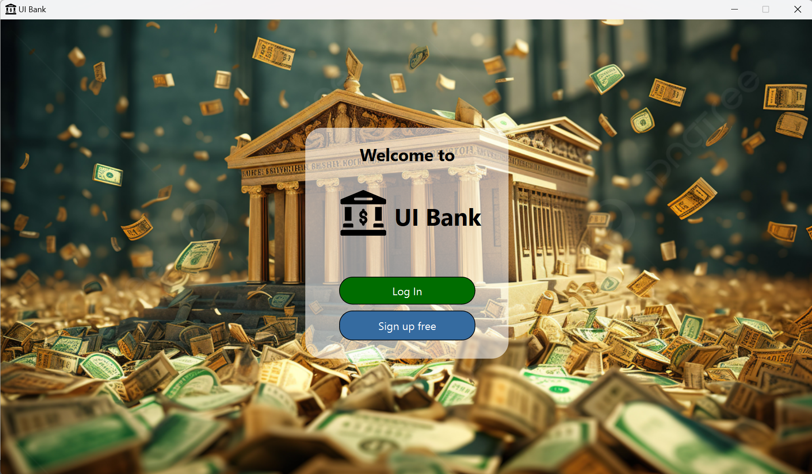
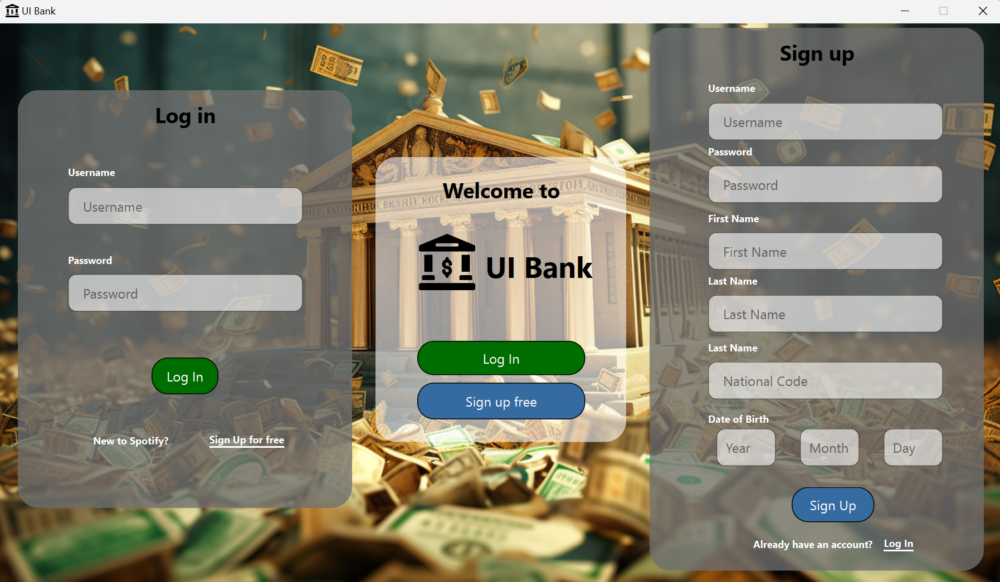
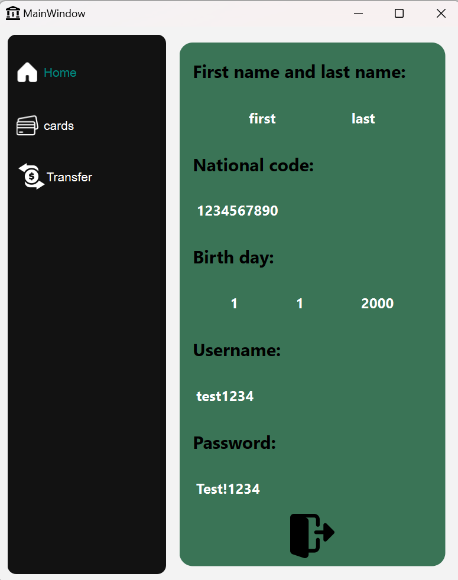
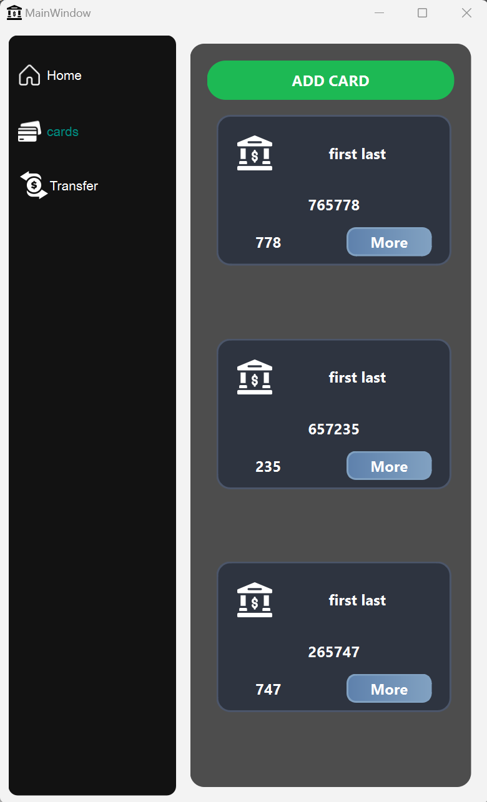
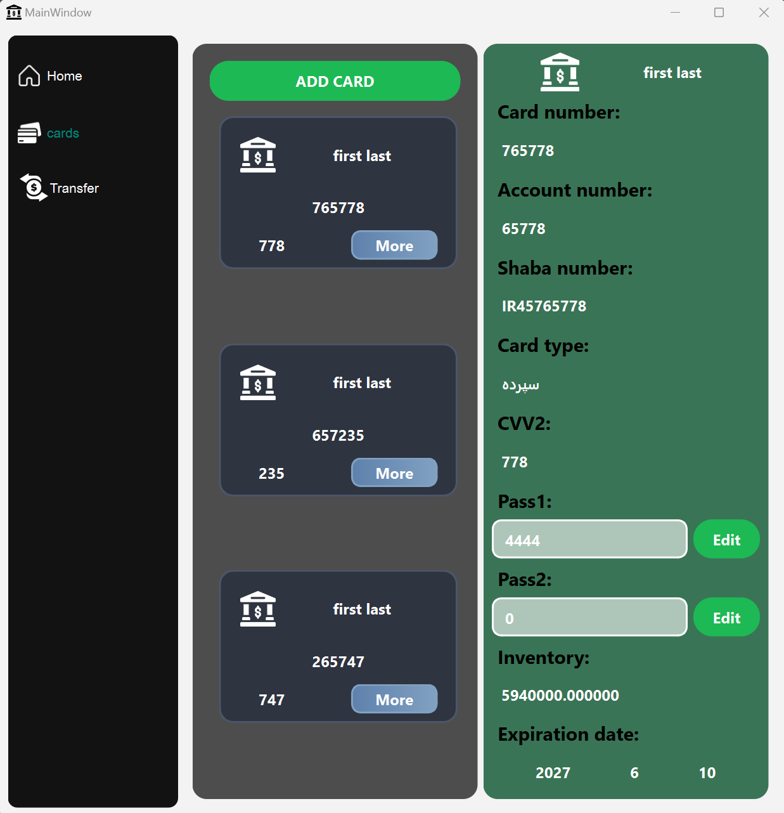
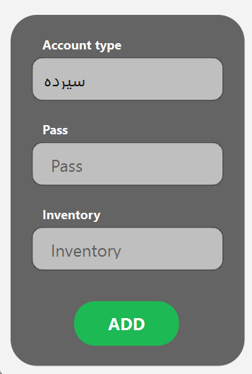
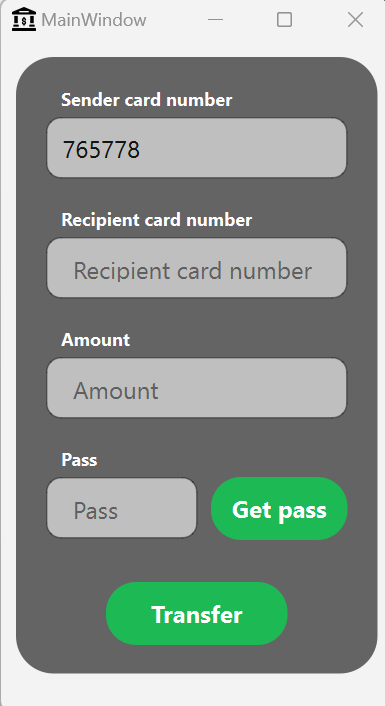

# Bank Project

An advanced C++ project simulating a simple banking system, allowing users to manage accounts, create cards, and perform secure card-to-card transactions. This project was developed during my advanced programming course to enhance my skills in advanced programming concepts and tools like databases, version control, and UI/UX design while focusing on real-world operations and integrating object-oriented programming principles, databases, and graphical user interfaces.

---

### Features
- **Account Registration and Login**: Users can register and log in to their accounts.
- **Card Creation and Management**: Create and manage cards with specific limitations.
- **Card-to-Card Transfers**: Perform card-to-card transactions with a secondary password.

---

### Learning Outcomes
Through this project, I gained valuable skills and insights, including:
- **Object-Oriented Programming (OOP)**: Implemented using C++ with clean coding practices.
- **Version Control**: Managed with Git for code versioning and collaboration.
- **Graphical Interface**: Built using the Qt framework to provide an intuitive UI/UX.
- **Database Management**: Integrated with SQLite to efficiently manage user data.
- **Custom Data Structures**: Includes a linked list implementation to handle account and transaction data.
- **Software Architecture**: Designed with a focus on modularity, scalability, and maintainability.

These experiences significantly enhanced my problem-solving abilities and provided a deeper understanding of modern software development practices.

---

### Preview

- **Login Page**:
  
  

  
  

- **Home**:
  
  

- **Card Management**:
  
  

  
  
  

- **Transfer**:
  
  

---

This was my first experience working with databases, graphics, version control systems like Git, and more, which proved to be extremely beneficial for my learning journey...
